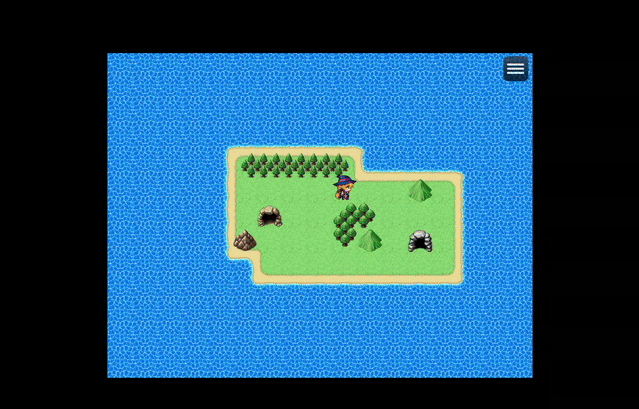

# iframe plugin for RPG Maker MZ

This plugin allows:
1. showing html page(s) in an iframe, one at a time
2. receiving callbacks triggered by the page
3. reacting to state changes in the page

[Demo game with PICO-8 and Pocket Platformer.](https://jakubiszon.github.io/rpg-maker-mz-iframe/)

| *Demo Preview* |
|:---:|
||

This program is shared under the [GNU LESSER GENERAL PUBLIC LICENSE](./LICENSE.md)

## Plugin Commands

1. ### `show` - shows a page in an iframe
   This command takes multiple [parameters documented in the code](./iframe.js).

1. ### `hide` - hides the iframe
   Takes no arguments, closes the iframe.

*Note:* If your code calls the `show` command multiple times - only the first call will take effect.
The next iframe can only be shown after calling the `hide` command.

## Known Issues
At the moment in some scenarios (e.g. when the window is resized) it is possible to deliver some events to the main window. This can move the character while the
iframe is being displayed.

The problem can be mitigated with:
- fade the screen out
- transfer the player to a location restricting their movement
- show iframe
- hide the iframe when your conditions are met
- transfer the player back to map
- fade the sceen in

If you know of a better workaround - let me know. Or maybe open a PR :D

<!-- ## Example Setup

|*Example event setup*|
|:---:|
|| -->


## Integrating with Pocket Platformer
You will need to use [Pocket Platformer integration fork](https://jakubiszon.github.io/pocket-platformer/).
If you already have a game you want to use - you only need to import it and export using it.

```js
// Callback parameters to use:
callbackPath: "gameEventCallback"
outputVariable: <variable>

// If you specify the outputVariable it will be assigned JSON
// with an array containing a single object, example:
'[{"eventName": "level-completed", "nextLevelindex": 2}]'

// In the common event launched by the plugin you can include an if script value
JSON.parse($gameVariables( <variable> ))[0].eventName === "level-completed"

// if you would like to apply different results depending on nextLevelindex do:
JSON.parse($gameVariables( <variable> ))[0].nextLevelindex == <number>
```


## Integrating with PICO-8

You will need to export your pico cartridge as a html page.
For the moment only the js (no WASM) version was tested.

In order for a PICO-8 program to pass data to javascript it needs to
call the `poke` function for any of the 128 bytes starting at `0X5F80` address.  Each of these bytes represents a single value of a variable `pivo8_pgio` which is visible inside the webpage running PICO-8.

As far as I know, there are no callbacks emitted from the PICO-8 page.
Setting up the plugin can rely on `watchPath` instead.

Watching all 128 I/O "pins":
```js
// Callback parameters to use:
watchPath: "pico8_gpio"

// in the scripts you can use JSON.parse to get the entire array:
JSON.parse($gameVariables( <variable> ))[0] // returns Array[number]

// you can access a specific PIN this way now:
JSON.parse($gameVariables( <variable> ))[0][ <pin_index> ]
```

Watching a single I/O "pin":
```js
// to watch a single number:
watchPath: "pico8_gpio/0" // will watch the very first pin

// in the scripts you can use JSON.parse to get value of that single "pin":
JSON.parse($gameVariables( <variable> ))[0] // returns a number stored in the pin at index 0
```

Also it is recommended to set exported `.html` to start the game automatically:
```
var p8_autoplay = true;
```
